# Comprehensive XOT Live App Audit

Date: 2026-05-15  
Live target: https://liquid-feed-flux.lovable.app/  
Supabase project: `jzirqfzzvlbxwfzndaer` (`XOT`)  
Local source: `main` at `4cd81ad` (`Fixed empty translated text bug`)  
Audit mode: read-only production review. No product code, database schema, Edge Function, or production data changes were made.

## Executive Summary

The application is live and functioning: the Lovable frontend loads, authenticated admin pages render, cron-triggered Edge Functions are running, and recent Edge Function logs show successful worker, media, and X posting executions. Local `lint`, `build`, and `tsc --noEmit` pass, but the test suite exits non-zero because Supabase Auth storage is not mocked correctly in Vitest.

The main risks are security and operational control-plane exposure. The database currently exposes multiple `SECURITY DEFINER` RPCs to `anon` and `authenticated`, including job claiming, retries, cleanup, reconciliation, and dashboard summary functions. The deployed `digest-compiler` Edge Function is active in Supabase but absent from this repository, accepts the public anon key as an internal authorization path, and can call OpenAI, post to X, and insert digest rows. RSS webhook tokens also appear in Edge Function request logs because the live webhook uses a `?token=` query parameter.

The largest quick wins are: revoke public execution on privileged RPCs, either remove or harden `digest-compiler`, rotate and move webhook credentials out of URLs, tighten RLS/read grants to admin-only, fix stale running jobs, and repair the mobile layout header/action overflows.

## Top Risks

| Priority | Area | Finding | Evidence | Recommended Fix |
| --- | --- | --- | --- | --- |
| P0 | Security | Public roles can execute privileged `SECURITY DEFINER` RPCs. | Live SQL showed `anon_execute=true` for `claim_jobs`, `cleanup_old_data`, `retry_step`, `reconcile_stuck_jobs`, `get_dashboard_summary`, `get_system_health`, `get_x_posting_summary`, `has_role`, `verify_webhook_internal_token`; migration source creates job mutation RPCs in `public`. | Revoke `EXECUTE` from `PUBLIC`, `anon`, and broad `authenticated`; move privileged functions to private schemas or gate via admin-only Edge Functions/service role. |
| P0 | Security / Deployment Drift | Active `digest-compiler` function is missing locally and authorizes with the public anon key. | Supabase lists `digest-compiler` version 56 active; no local `supabase/functions/digest-compiler`; deployed source accepts `Authorization: Bearer <anon key>` and `verify_jwt=false`. | Disable until reviewed, remove anon-key authorization, require internal token/service role only, add source to repo and CI. |
| P1 | Secrets | RSS webhook token is logged in Supabase Edge Function URLs. | Edge logs include `webhooks-rssapp?token=[REDACTED]`. Local auth accepts query tokens in `supabase/functions/_shared/internalAuth.ts:45`. | Rotate token, use RSS.app signed webhooks or `x-webhook-token`/`x-rssapp-token` header fallback, reject query tokens after migration, scrub logs. |
| P1 | Auth / Data Access | App allows protected UI while role is still `null`; RLS also allows broad authenticated reads. | [AppLayout.tsx](../../src/components/layout/AppLayout.tsx) renders protected shell unless `role !== null && !isAdmin`; [AuthContext.tsx](../../src/contexts/AuthContext.tsx) sets `loading=false` before deferred role load on auth changes. | Treat unknown role as loading/denied; make data policies admin-only; add tests for non-admin transition. |
| P1 | Reliability | Stale running jobs remain in production. | Live SQL: `resolve_media` has 4 running jobs older than 6h, oldest from 2026-04-30; `deliver` and `compute_signature` each have stale >6h; 33 translate jobs stale >30m. | Run and verify reconciliation, make lease expiry automatic and observable, alert on stale running jobs. |

## System Diagrams

### Lovable Frontend Route Map

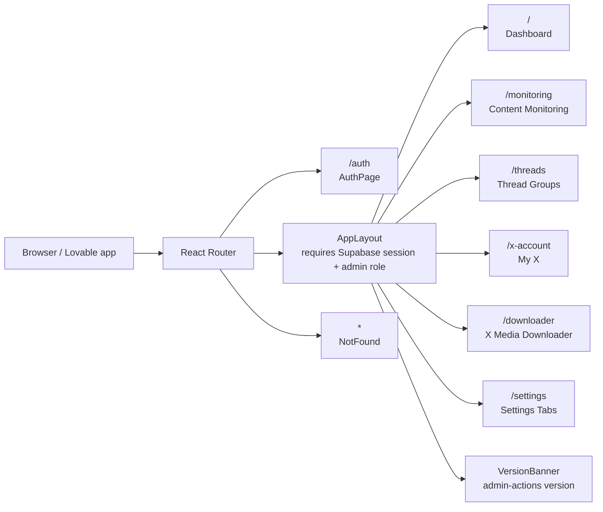

### Content Pipeline

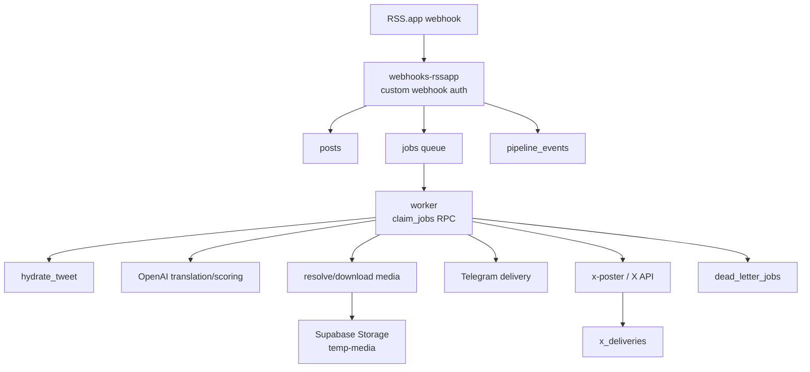

### Supabase Surface

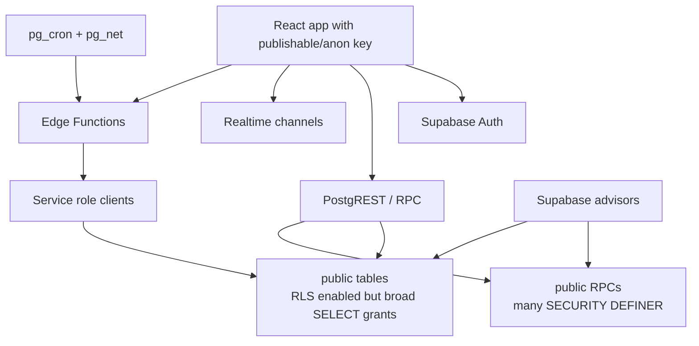

### Cron And Edge Function Execution Flow

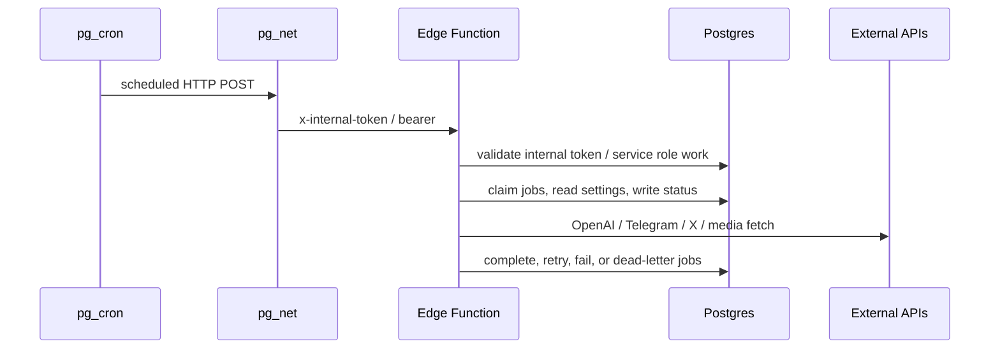

### Admin UI Data Flow

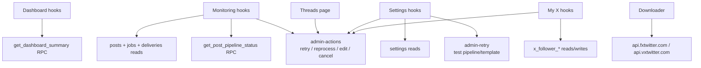

## Findings

| ID | Severity | Category | Finding | Evidence | Impact | Recommendation |
| --- | --- | --- | --- | --- | --- | --- |
| F-01 | P0 | Security | Privileged `SECURITY DEFINER` RPCs are executable by public roles. | Live SQL and Supabase advisors confirm `anon_execute=true` for `claim_jobs`, `cleanup_old_data`, `retry_step`, `reconcile_stuck_jobs`, `get_dashboard_summary`, `get_system_health`, `get_x_posting_summary`, `has_role`, `verify_webhook_internal_token`; [20260320004655 migration](../../supabase/migrations/20260320004655_04a925c9-fd01-4fa6-a88e-c48f93ad480e.sql) defines `claim_jobs`; [20250903140000 migration](../../supabase/migrations/20250903140000_rpc_pipeline_status_and_retry.sql) defines `retry_step`. | Anonymous callers can potentially alter queue state, enqueue retries, run cleanup/reconcile paths, or read operational summaries through `/rest/v1/rpc/*`. | Revoke execute from `PUBLIC`, `anon`, and non-admin `authenticated`; place privileged functions in private schemas; call them only from Edge Functions using service role. |
| F-02 | P0 | Security / Deployment | `digest-compiler` is deployed but absent locally and accepts anon-key authorization. | Supabase active functions list includes `digest-compiler` v56; local function list does not. Deployed source fetched read-only shows `verify_jwt=false`, `Access-Control-Allow-Origin: *`, `Authorization: Bearer <anon key>` accepted, and no auth if internal secret is unset. | Public anon key is browser-visible; a caller can invoke a function that can summarize posts, call OpenAI, post to X, and insert digest rows. Dry-run also returns raw post/prompt content. | Disable or undeploy until hardened; remove anon-key and missing-secret bypasses; require `x-internal-token` or service role; add local source and CI coverage. |
| F-03 | P1 | Secrets | RSS webhook secret is sent in the query string and appears in Edge logs. | Live edge logs show `webhooks-rssapp?token=[REDACTED]`; [internalAuth.ts](../../supabase/functions/_shared/internalAuth.ts) accepts `urlObj.searchParams.get('token')`. | Anyone with access to logs can recover the active webhook secret; query strings also propagate through intermediaries more readily than headers. | Rotate the secret, prefer RSS.app signed webhooks, fall back to `x-webhook-token` or `x-rssapp-token` if signing is unavailable, reject query tokens after RSS.app update, and add log scrubbing. |
| F-04 | P1 | Auth / RLS | Protected UI and data are not consistently admin-only. | [AppLayout.tsx](../../src/components/layout/AppLayout.tsx) only blocks when `role !== null && !isAdmin`; [AuthContext.tsx](../../src/contexts/AuthContext.tsx) defers role loading after auth events; migrations grant “Authenticated can view ...” across many tables. | A signed-in non-admin may briefly see admin shell and can read broad operational data where RLS allows any authenticated user. | Treat `role === null` as unresolved and do not render protected content; replace broad authenticated read policies with admin checks; test non-admin sessions. |
| F-05 | P1 | Data Exposure | Public GraphQL/Data API grants expose many objects to `anon`. | Supabase security advisor flags `public.accounts`, `posts`, `jobs`, `settings`, `user_roles`, `telegram_*`, `x_*`, and views as visible because `anon` can `SELECT`. Live SQL confirmed four public views have `anon_select=true`. | Schema/data discoverability is wider than an admin panel should allow. RLS may still restrict rows, but grants and views increase exposure and attack surface. | Revoke table/view `SELECT` from `anon`; use admin-only policies; set views to `security_invoker=true` or revoke exposed role access. |
| F-06 | P1 | Reliability | Stale running jobs show lease recovery is not fully effective. | Live SQL: `resolve_media` 4 running jobs older than 6h, oldest `2026-04-30`; `deliver` and `compute_signature` stale >6h; `translate` 33 stale >30m. Reconcile logic exists in [20260507235716 migration](../../supabase/migrations/20260507235716_30c84cee-4ac9-41c8-9685-3f7ea981711c.sql). | Queue metrics and processing can be misleading; stale locks can block idempotent job recreation or hide failed work. | Run reconciliation on a verified schedule, alert on `running` age, and close the loop by recording reconciled counts in health dashboards. |
| F-07 | P1 | Production Drift | Remote Edge Function set does not match repository. | Remote functions: `webhooks-rssapp`, `admin-retry`, `worker`, `media-cleanup`, `media-processor`, `db-cleanup`, `admin-actions`, `digest-compiler`, `x-poster`, `x-followers-snapshot`; local source lacks `digest-compiler`. | Production behavior cannot be fully reproduced or reviewed from source control. | Pull the deployed function into `supabase/functions`, review it, and make CI compare local and remote function inventory before deploys. |
| F-08 | P2 | Test Correctness | `npm test` exits non-zero despite passing assertions. | Vitest reports 2 files and 6 tests passed, then fails on unhandled `TypeError: storage.getItem is not a function` from Supabase Auth. [client.ts](../../src/integrations/supabase/client.ts) passes `storage: localStorage`; [setup.ts](../../src/test/setup.ts) only mocks `matchMedia`. | CI blocks on tests and auth behavior is not reliably covered. | Inject/test-mock Supabase client storage; set up a jsdom-compatible storage mock before importing the client; add auth role loading tests. |
| F-09 | P2 | Dependencies | `npm audit` reports 18 vulnerabilities, including 9 high. | Direct/transitive advisories affect `react-router-dom`/`react-router`, `vite`, `postcss`, `rollup`, `lodash`, `minimatch`, `picomatch`, `glob`, `flatted`, `jsdom`. | Security and supply-chain risk, especially for tooling and routing packages. | Upgrade direct dependencies, run the test/build suite, and review semver-major `jsdom` update separately. |
| F-10 | P2 | Edge Security | Admin and internal functions use `verify_jwt=false` and wildcard CORS. | Supabase function list shows all active functions with `verify_jwt=false`; [admin-actions](../../supabase/functions/admin-actions/index.ts), [webhooks-rssapp](../../supabase/functions/webhooks-rssapp/index.ts), and remote `digest-compiler` use `Access-Control-Allow-Origin: *`. | Correctness relies entirely on custom guards. A single missed guard becomes remotely callable from any origin. | Keep custom auth only for true webhooks/cron; enable JWT verification where possible; restrict admin CORS to Lovable domain; add guard tests. |
| F-11 | P2 | Runtime / Logs | Webhook and worker logs include high-volume operational details. | [webhooks-rssapp](../../supabase/functions/webhooks-rssapp/index.ts) logs payload keys and processing details; edge logs expose full request URLs. | Larger log volume, possible content leakage, harder incident review. | Use structured, redacted logs with event IDs/counts; never log raw URLs with secrets or content. |
| F-12 | P2 | Mobile UI | Header/action layouts overflow on mobile. | Mobile screenshots show top header text clipped, Dashboard `Online` button partly off-screen, Monitoring `Cancel Pending Jobs` overflow, Settings tabs overlapping. See screenshot gallery. | Mobile admin workflows are hard to use and can hide critical controls. | Make header wrap or collapse status pills; stack action buttons; convert Settings tabs to scrollable/select menu at narrow widths. |
| F-13 | P2 | UX Safety | Live posting/test actions are close to normal settings actions. | [Settings.tsx](../../src/pages/Settings.tsx) has `Test Pipeline` and `Test Message` buttons next to save actions; [XAutomationSettings.tsx](../../src/components/settings/XAutomationSettings.tsx) can send test tweets with only local one-minute rate limiting. | Admins can accidentally send live Telegram/X content from configuration screens. | Add confirmation dialogs for production-posting/test-send actions, show destination/channel/account, and separate “dry run” preview from live send. |
| F-14 | P2 | Database Performance | RLS policies and indexes have advisor warnings. | Supabase performance advisor flags unindexed FKs on `x_follower_changes`, many per-row `auth.uid()` RLS evaluations, duplicate indexes on `jobs`, `telegram_daily_stats`, `telegram_message_analytics`, and `net._http_response` bloat. | Slower queries as data grows, unnecessary write overhead, and more expensive policy evaluation. | Add missing FK indexes, rewrite policies with `(select auth.uid())`, remove duplicate indexes after checking usage, and schedule net table maintenance. |
| F-15 | P2 | Bundle Performance | Chart and settings chunks are heavy. | `npm run build`: `vendor-charts` 375.54 kB raw / 103.36 kB gzip; `Settings` 152.84 kB raw; `Monitoring` 91.34 kB raw. | Slower first visit to analytics/settings-heavy admin pages. | Lazy-load Recharts only where charts are visible; split Settings tab panels by route/tab; consider component-level dynamic import. |
| F-16 | P2 | Configuration Portability | Supabase URL/key are hardcoded in generated client. | [client.ts](../../src/integrations/supabase/client.ts) embeds project URL and anon JWT instead of using `VITE_SUPABASE_URL` / `VITE_SUPABASE_PUBLISHABLE_KEY`. | More difficult to stage/rotate keys; accidental production targeting from local builds. | Use environment variables and validate them at startup; keep generated types separate from runtime config. |
| F-17 | P2 | Browser Privacy / Reliability | Downloader calls third-party X proxy APIs directly from the browser. | [Downloader.tsx](../../src/pages/Downloader.tsx) calls `api.fxtwitter.com` then `api.vxtwitter.com` from the admin client. | Admin-entered URLs and usage patterns are shared with third parties; CORS/rate-limit failures surface directly to the UI. | Move extraction to a server-side function with timeouts, logging, and privacy controls, or clearly label third-party dependency. |
| F-18 | P3 | Maintainability | Edge Function code is not linted by project ESLint. | [eslint.config.js](../../eslint.config.js) ignores `supabase/functions/**`; largest files include `worker/index.ts` at 2,625 lines and `admin-actions/index.ts` at 1,510 lines. | Runtime TypeScript/Deno regressions can escape CI; large files are hard to review safely. | Add Deno lint/type checks for Edge Functions; split worker/admin actions by domain. |
| F-19 | P3 | Type Safety | App TypeScript settings are intentionally loose. | [tsconfig.app.json](../../tsconfig.app.json) has `strict=false`, `noImplicitAny=false`, `strictNullChecks=false`; code uses several `as any` casts. | Null/shape errors are harder to catch before runtime. | Enable strictness incrementally by folder; prioritize hooks and integration layers. |
| F-20 | P3 | Browser Hardening | Live response has useful security headers but no CSP observed. | `curl -I` returned HSTS, `referrer-policy`, and `x-content-type-options`; no `Content-Security-Policy` header observed. | XSS blast radius is larger for an admin app with live tokens/session. | Add CSP appropriate for Lovable/Supabase assets and external APIs, then monitor/report violations before enforcement. |
| F-21 | P3 | Version Metadata | Backend version action is intentionally unauthenticated. | [admin-actions](../../supabase/functions/admin-actions/index.ts) returns `version` before `requireAdmin`; [VersionBanner.tsx](../../src/components/layout/VersionBanner.tsx) calls it from the UI. | Low-sensitivity metadata leak, but still part of a broader public control surface. | Keep if needed, but limit returned metadata and add rate limiting/CORS restrictions. |

## Bugs And Correctness

- Tests fail because Supabase Auth starts async storage work against a storage object that does not implement the expected interface in Vitest. The fix should be in the test setup/client seam, not by weakening the test.
- Auth role loading has a race: `onAuthStateChange` sets `loading=false` before the deferred role query finishes. The layout then renders protected UI while `role` is still `null`.
- `digest-compiler` has production behavior that is not represented locally. This is both a deployment bug and a reviewability bug.
- `invoke-worker-every-15s` is scheduled as `*/2 * * * *`, so the cron job name and actual cadence disagree.
- Live Monitoring mobile initially showed a long spinner before data appeared, and the final loaded state still overflows controls. The data fetch may be acceptable, but the loading and narrow layout state need work.

## Security

The security posture should be tightened around Supabase exposed surfaces first. The project already uses RLS on public tables, but table/view grants, broad authenticated policies, and public `SECURITY DEFINER` functions create a much larger control surface than an admin-only app should have.

Immediate hardening sequence:

1. Revoke public execution for privileged RPCs.
2. Move privileged functions to private schemas or require service role Edge wrappers.
3. Revoke `anon` table/view SELECT grants that are not intentionally public.
4. Convert admin data policies from `auth.uid() IS NOT NULL` to admin role checks.
5. Disable or harden `digest-compiler`.
6. Rotate webhook secrets and remove query-token authentication.
7. Enable leaked password protection in Supabase Auth.

The migration [20260513180000_verify_webhook_internal_token.sql](../../supabase/migrations/20260513180000_verify_webhook_internal_token.sql) appears to intend service-role-only access to `verify_webhook_internal_token`, but the live project currently reports `anon_execute=true` and `authenticated_execute=true`. Treat this as drift or a later privilege regression and verify grants directly before/after remediation.

## Backend Reliability

Cron health is mostly good: all observed cron jobs are active and recent Edge Function logs are returning HTTP 200 for worker, media processor, x-poster, admin actions, and webhook invocations. However, stale running jobs show lease cleanup is not closing all cases.

Active cron jobs observed:

| Job | Schedule | Note |
| --- | --- | --- |
| `x-followers-snapshot-daily` | `0 3 * * *` | Daily snapshot. |
| `invoke-db-cleanup-daily` | `0 3 * * *` | Daily cleanup. |
| `invoke-worker-every-15s` | `*/2 * * * *` | Name says 15s, actual schedule is every 2 minutes. |
| `invoke-media-cleanup-6h` | `0 */6 * * *` | Six-hour cleanup. |
| `x-poster-tick` | `* * * * *` | Every minute. |
| `rebuild-learned-biases-6h` | `0 */6 * * *` | Six-hour learned signal rebuild. |

Job totals snapshot:

| Type | Completed | Failed | Running |
| --- | ---: | ---: | ---: |
| `translate` | 4,166 | 369 | 55 |
| `download_media` | 1,757 | 2 | 0 |
| `compute_signature` | 1,867 | 0 | 1 |
| `resolve_media` | 569 | 0 | 4 |
| `deliver` | 654 | 2 | 1 |
| `hydrate_tweet` | 69 | 3 | 0 |
| `enrich` | 9 | 0 | 0 |
| `reprocess` | 4 | 0 | 0 |

Stale running snapshot:

| Type | Running | Stale >30m | Stale >6h | Oldest Running |
| --- | ---: | ---: | ---: | --- |
| `resolve_media` | 4 | 4 | 4 | 2026-04-30T14:04:01Z |
| `deliver` | 1 | 1 | 1 | 2026-05-14T13:56:15Z |
| `compute_signature` | 1 | 1 | 1 | 2026-05-14T16:56:02Z |
| `translate` | 55 | 33 | 0 | 2026-05-15T05:02:02Z |

## Performance And Optimization

- The database advisor findings are actionable and low-risk to plan: missing FK indexes, duplicated indexes, RLS initplan rewrites, and cleanup of `net._http_response` bloat.
- The frontend already uses route-level code splitting, but the chart vendor chunk is the largest asset. Lazy-load chart-heavy UI only when a chart is visible.
- Monitoring subscribes to all changes on `posts`, `jobs`, and `deliveries` and debounces invalidation. This is practical for an admin panel, but it can churn under high ingest volume. Consider coarser invalidation signals or a materialized status channel once traffic grows.
- `get_dashboard_summary` is useful, but it is currently public executable. Keep the RPC optimization pattern while fixing grants.

## UI And UX Improvements

Desktop is generally usable and visually consistent, but the layout has a dark, card-heavy one-note feel. This is acceptable for an internal admin tool, yet density could be improved: large metric cards consume much of the first viewport while operational queues and failures sit lower.

Mobile needs more immediate attention:

- The fixed header is too short for its content; title/subtitle and version pills clip at the top.
- Dashboard actions do not wrap cleanly; `Online` is partially off-screen.
- Monitoring places destructive and refresh/filter actions in the same row; `Cancel Pending Jobs` overflows.
- Settings tabs overlap and become unreadable. Use a horizontal scroll area with clear active state or a mobile select/combobox.
- Dense setting forms should use single-column mobile layouts, with live-send/test buttons separated from save buttons.

## Maintainability

The codebase has clear separation between pages, hooks, UI components, Supabase integrations, and Edge Functions, but there are three maintainability risks:

- Edge Functions are operationally critical but excluded from ESLint and not type-checked in CI.
- `worker/index.ts` and `admin-actions/index.ts` are very large control-plane files; split by queue stage/admin domain.
- Database migrations are numerous and include repeated recreate patterns. Add privilege assertions and migration smoke tests so intended revokes stay true in production.

## Screenshot Gallery

Screenshots were captured from the authenticated live app with Playwright masks over tables, inputs, images, code, and text-heavy private content.

| Route | Desktop | Mobile |
| --- | --- | --- |
| Auth | 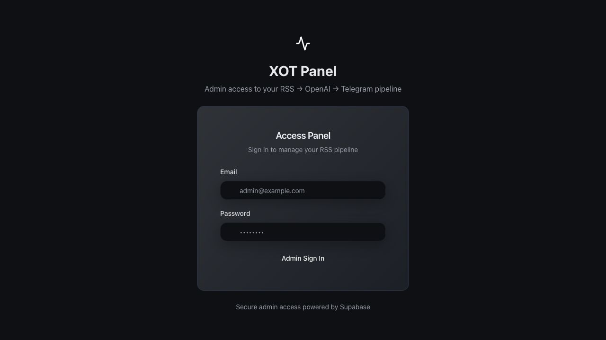 | Not captured after login; auth desktop confirms entry screen. |
| Dashboard | 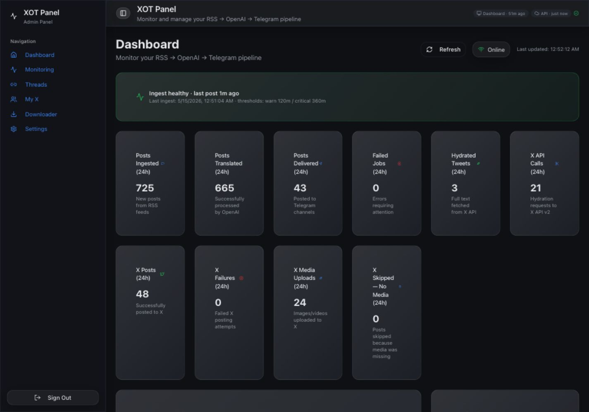 | 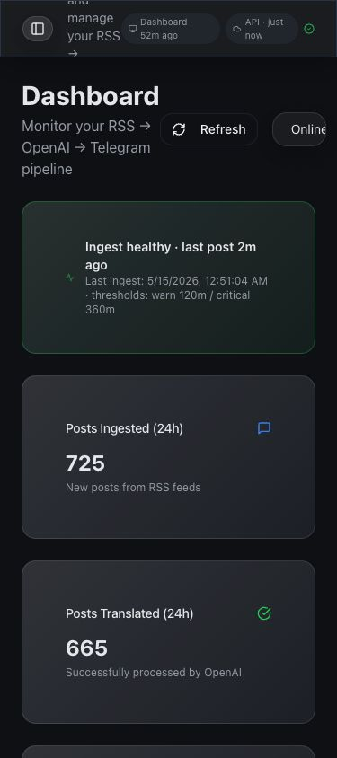 |
| Monitoring | 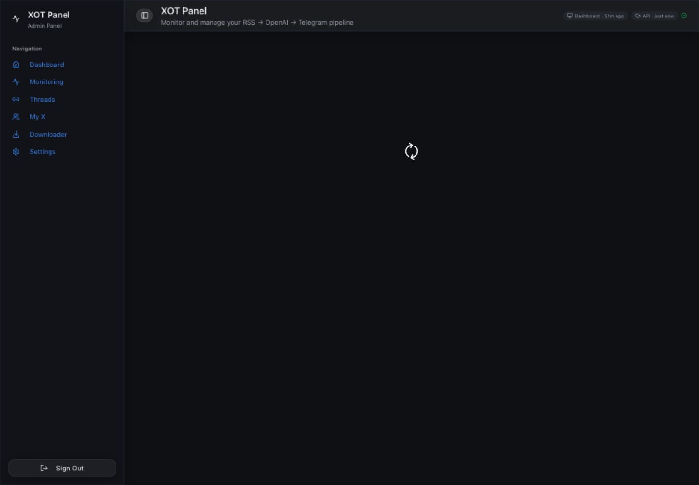 | 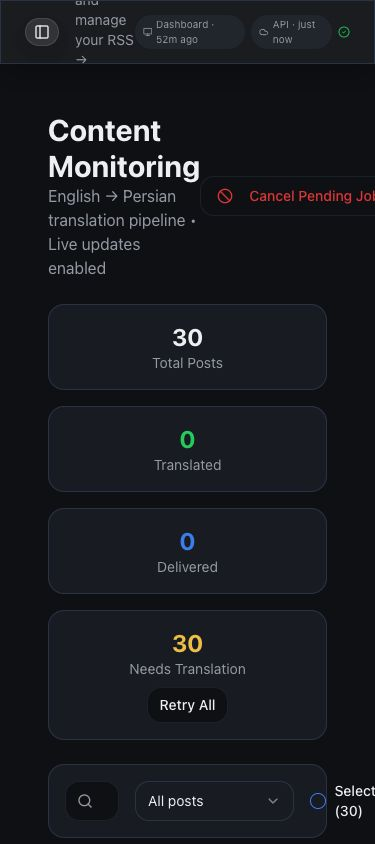 |
| Threads | 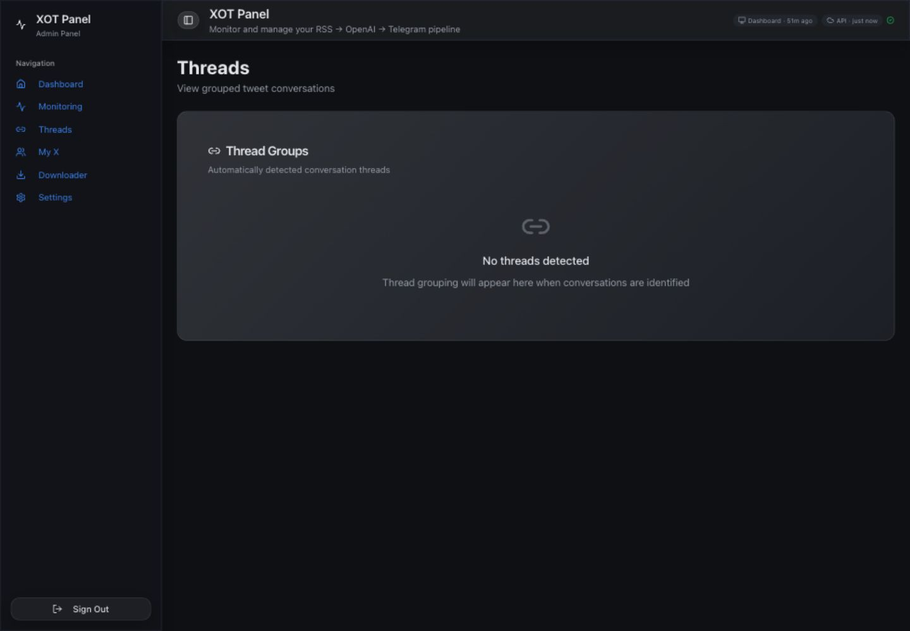 | 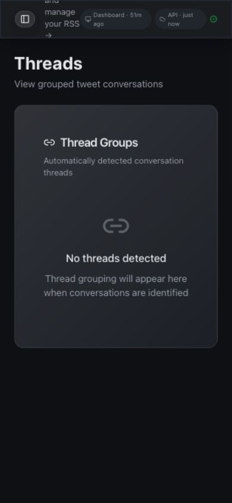 |
| My X | 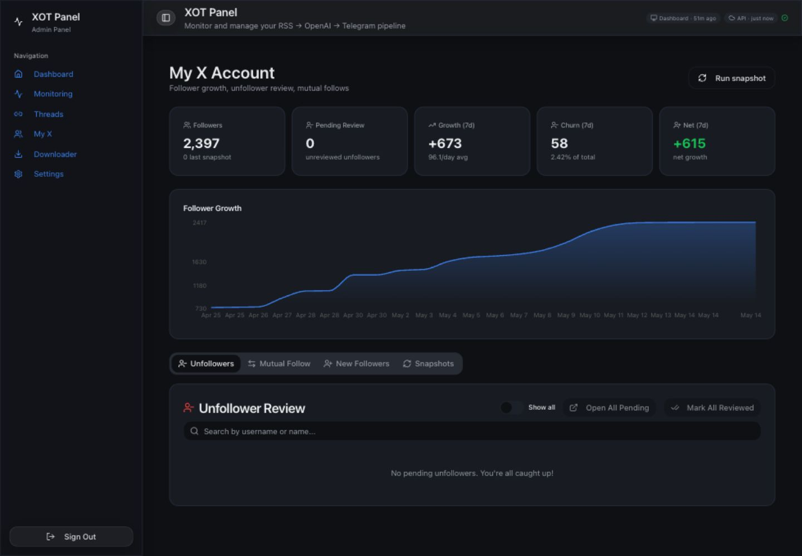 | 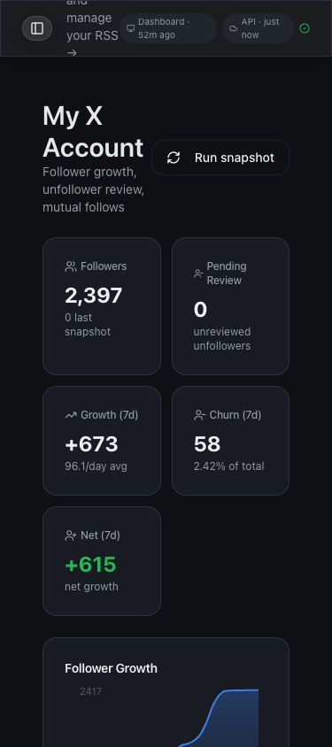 |
| Downloader | 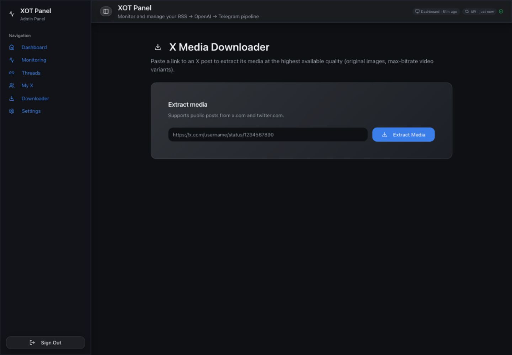 | 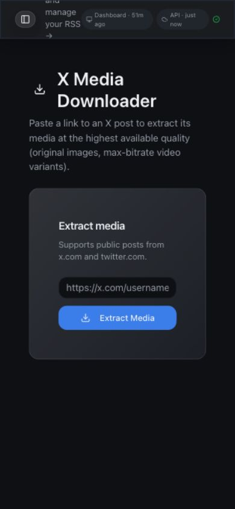 |
| Settings | 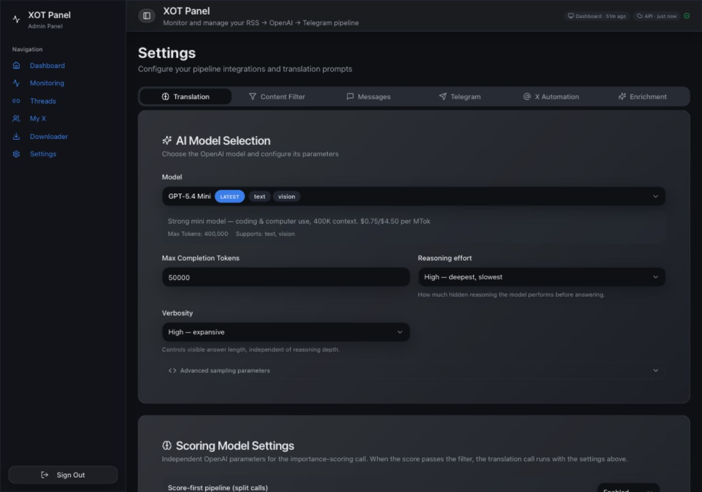 | 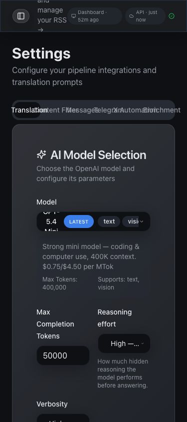 |
| Not Found | 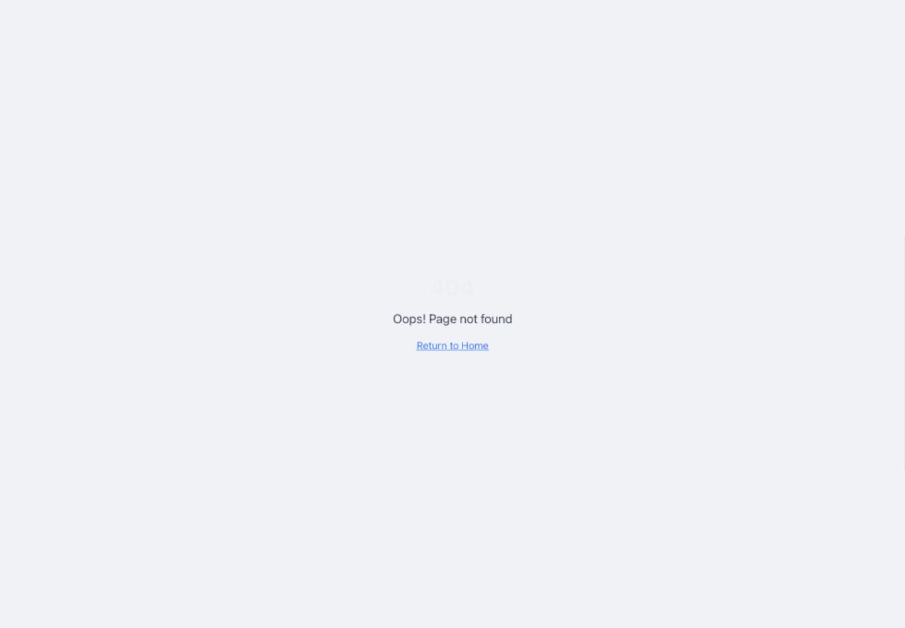 |  |

## Prioritized Remediation Backlog

### Immediate

1. Disable or harden `digest-compiler`; remove anon-key auth and add source to the repo.
2. Revoke `EXECUTE` on privileged RPCs from `PUBLIC`, `anon`, and broad `authenticated`.
3. Rotate RSS webhook token and move RSS.app authentication to a header-only secret.
4. Fix `AppLayout`/`AuthContext` so unresolved role never renders protected UI.
5. Clear stale running jobs through a verified, logged reconciliation path.

### Short Term

1. Tighten RLS/read grants to admin-only and make views `security_invoker` or unexposed.
2. Repair `npm test` by mocking/injecting Supabase Auth storage.
3. Add Deno lint/type checks for `supabase/functions`.
4. Fix mobile header/action/tabs layout.
5. Add confirmations and destination summaries to live-send/test-post actions.
6. Upgrade vulnerable dependencies and regenerate lockfile after test/build verification.

### Later

1. Split `worker` and `admin-actions` into smaller domain modules.
2. Lazy-load chart/settings-heavy modules and watch bundle size budgets.
3. Add a CI check that remote Supabase functions match local source inventory.
4. Add CSP in report-only mode, then enforce once violations are resolved.
5. Add operational alerts for cron failures, stale leases, queue depth, X/Telegram error rates, and webhook token failures.

## Appendix A: Commands Run

| Command | Result |
| --- | --- |
| `npm ci` | Succeeded; installed dependencies; reported 18 vulnerabilities. |
| `npm run lint` | Exit 0 with warnings: stale eslint disable/missing hook dependency in `XAutomationSettings`, and Fast Refresh export warnings in UI/context files. |
| `npm test` | Exit 1 due unhandled Supabase Auth storage errors, despite 6 assertions passing. |
| `npm run build` | Exit 0; Vite build succeeded; caniuse-lite warning. |
| `npx tsc --noEmit` | Exit 0. |
| `npm audit --json` | Exit 1; 18 vulnerabilities, 9 high. |
| `curl -I https://liquid-feed-flux.lovable.app/` | HTTP 200; HSTS/referrer/content-type headers present; no CSP observed. |
| Browser route review | Authenticated GET navigation only; no save/retry/cancel/post/test actions clicked. |
| Supabase `_list_edge_functions` | 10 active functions, including remote-only `digest-compiler`. |
| Supabase `_get_advisors` | Security and performance warnings confirmed. |
| Supabase read-only SQL | Function grants, cron, job totals, stale running jobs, and view grants checked. |
| Supabase logs | Edge and Postgres logs reviewed; sensitive tokens redacted in this report. |

## Appendix B: Supabase Read-Only Checks

Security advisors:

- `extension_in_public`: `vector` installed in `public`.
- `pg_graphql_anon_table_exposed`: many operational tables/views visible to `anon`.
- `anon_security_definer_function_executable`: multiple public `SECURITY DEFINER` RPCs exposed.
- `authenticated_security_definer_function_executable`: multiple public `SECURITY DEFINER` RPCs exposed to signed-in users.
- `auth_leaked_password_protection`: disabled.

Performance advisors:

- Unindexed FKs: `x_follower_changes.curr_snapshot_id`, `x_follower_changes.prev_snapshot_id`.
- RLS initplan warnings on many policies using `auth.uid()`/role checks directly.
- Multiple permissive SELECT policies on many admin tables.
- Duplicate indexes: `jobs`, `telegram_daily_stats`, `telegram_message_analytics`.
- Bloat: `net._http_response`.

Postgres logs:

- Repeated warning: database `postgres` has a collation version mismatch.
- Frequent pg_cron and PostgREST connection activity.

Edge logs:

- Recent worker/media/x-poster/admin-actions executions returned HTTP 200.
- RSS webhook requests expose a `token` query parameter in log URLs; token redacted here.

## Appendix C: Audit Limitations

- This was a read-only audit. I did not click live mutating actions such as cancel, retry, save, send, test webhook, test message, approve/reject, reprocess, or post.
- I did not inspect private production row contents beyond aggregate/status metadata needed for health checks.
- Authenticated screenshots are masked to avoid storing private feed/user content; they are best used for layout evidence, not data review.
- The deployed `digest-compiler` source was fetched from Supabase read-only, but it is not present in this repo. Its full source should be brought under version control before remediation.
- Dependency vulnerability severity comes from `npm audit`; each advisory still needs upgrade testing for runtime compatibility.

## Acceptance Criteria Check

| Criterion | Status |
| --- | --- |
| Evidence-backed findings, not generic advice | Met. Findings include code paths, live SQL/advisors/logs, commands, and screenshots. |
| Concrete fix or next diagnostic for every finding | Met. Each finding has a recommendation. |
| Main app routes covered | Met: Auth, Dashboard, Monitoring, Threads, My X, Downloader, Settings, Not Found. |
| Local and active Supabase functions covered | Met with limitation: remote-only `digest-compiler` reviewed from deployed source and flagged as drift. |
| Desktop and mobile screenshots | Met for authenticated routes; Auth captured desktop before login. |
| No production mutation | Met. Audit interactions were GET navigation, read-only SQL, advisors/logs, and masked screenshots. |
